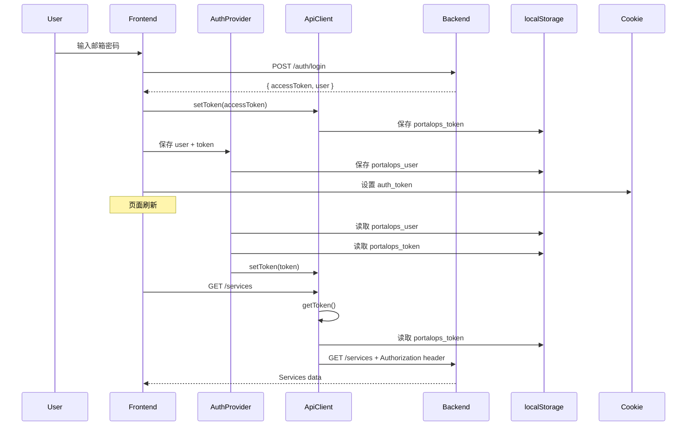

# 认证问题修复指南

## 问题描述

用户登录后访问页面时，所有 API 请求返回 `403 Forbidden` 错误：

```
{"error":"http_error","message":"Could not validate credentials"}
```

终端日志显示：
```
INFO:     127.0.0.1:53663 - "GET /api/products HTTP/1.1" 403 Forbidden
INFO:     127.0.0.1:53663 - "GET /api/services HTTP/1.1" 403 Forbidden
INFO:     127.0.0.1:60787 - "GET /api/users HTTP/1.1" 403 Forbidden
```

## 根本原因

**Token 未正确传递给 API 请求**

系统有两个问题：

1. **API 客户端 token 初始化不可靠**
   - `getToken()` 方法只在首次调用时从 localStorage 读取
   - 页面刷新或多标签页场景下，token 可能未正确同步
   
2. **AuthProvider 初始化流程不完整**
   - useEffect 中恢复用户数据时，没有确保 API 客户端也得到 token
   - 缺少详细的调试日志，无法快速定位问题

## 修复内容

### 1. 增强 API 客户端的 Token 管理 (`lib/api.ts`)

#### 修改点 1: `getToken()` 方法 - 始终从 localStorage 读取最新 token

**之前的问题：**
```typescript
getToken(): string | null {
  if (this.token) return this.token  // 只返回内存中的 token
  // ... fallback logic
}
```

**修复后：**
```typescript
getToken(): string | null {
  // 始终尝试从 localStorage 获取最新 token
  if (typeof window !== 'undefined') {
    const storedToken = localStorage.getItem('portalops_token')
    if (storedToken && storedToken !== this.token) {
      // Token 更新了，同步到内存
      this.token = storedToken
      console.log('[API Client] Token synced from localStorage')
    }
    if (storedToken) {
      return storedToken
    }
  }
  
  // 回退到内存 token
  if (this.token) {
    return this.token
  }
  
  return null
}
```

**优势：**
- ✅ 每次 API 请求都获取最新的 token
- ✅ 支持多标签页场景（一个标签登录，其他标签自动获取 token）
- ✅ 避免内存 token 过期的问题

#### 修改点 2: 增强调试日志

**请求日志：**
```typescript
if (token) {
  headers.Authorization = `Bearer ${token}`
  console.log(`[API Request] ${method} ${endpoint} - With Auth Token: ${token.substring(0, 30)}...`)
} else {
  console.error(`[API Request] ${method} ${endpoint} - ⚠️  NO TOKEN! Request will likely fail with 403`)
  // 详细诊断
  if (typeof window !== 'undefined') {
    const lsToken = localStorage.getItem('portalops_token')
    if (lsToken) {
      console.error('[API Request] Token EXISTS in localStorage but not returned by getToken()!')
    } else {
      console.error('[API Request] No token in localStorage either')
    }
  }
}
```

**响应日志：**
```typescript
console.log(`[API Response] ${method} ${endpoint} - Status: ${response.status}`)
```

### 2. 改进 AuthProvider 初始化逻辑 (`providers/auth-provider.tsx`)

#### 修改点 1: 异步初始化函数

**之前的问题：**
```typescript
useEffect(() => {
  const storedUser = localStorage.getItem('portalops_user')
  if (storedUser) {
    setUser(JSON.parse(storedUser))
    // 但没有确保 apiClient.setToken() 被调用！
  }
  setIsLoading(false)
}, [])
```

**修复后：**
```typescript
useEffect(() => {
  const initializeAuth = async () => {
    console.log('[Auth Provider] Initializing authentication...')
    
    const storedUser = localStorage.getItem('portalops_user')
    const storedToken = localStorage.getItem('portalops_token')
    
    console.log('[Auth Provider] Stored user exists:', !!storedUser)
    console.log('[Auth Provider] Stored token exists:', !!storedToken)
    
    if (storedUser) {
      const userData = JSON.parse(storedUser)
      setUser(userData)
      
      // 🔑 关键修复：确保 token 被设置到 API 客户端
      const token = userData.accessToken || storedToken
      if (token) {
        console.log('[Auth Provider] ✓ Restoring token from localStorage')
        apiClient.setToken(token)
      } else {
        console.error('[Auth Provider] ✗ User data exists but NO TOKEN found!')
      }
    } else if (storedToken) {
      // Token 存在但用户数据不存在 - 尝试获取用户资料
      console.log('[Auth Provider] Found token without user, fetching profile...')
      apiClient.setToken(storedToken)
      
      try {
        const profile = await authApi.getProfile()
        // ... 创建并保存用户数据
        console.log('[Auth Provider] ✓ User profile fetched and stored')
      } catch (err) {
        console.error('[Auth Provider] ✗ Failed to fetch user profile:', err)
        // 清除无效 token
        apiClient.clearToken()
        localStorage.clear()
      }
    }
    
    setIsLoading(false)
  }
  
  initializeAuth()
}, [])
```

#### 修改点 2: 增强登录流程日志

```typescript
const login = async (email: string, password: string): Promise<boolean> => {
  console.log('[Auth Provider] Logging in with email:', email)
  
  const response = await authApi.login(email, password)
  console.log('[Auth Provider] Login successful, received token')
  
  // 🔑 关键：先设置 token
  apiClient.setToken(response.accessToken)
  console.log('[Auth Provider] Token set in API client')
  
  // 设置 cookie
  document.cookie = `auth_token=${response.accessToken}; path=/; max-age=${60 * 60 * 24 * 7}`
  console.log('[Auth Provider] Token stored in cookie')
  
  // 获取用户资料
  const userProfile = await authApi.getProfile()
  console.log('[Auth Provider] User profile fetched:', userProfile.email)
  
  // 保存用户数据
  localStorage.setItem('portalops_user', JSON.stringify({
    ...userData,
    accessToken: response.accessToken
  }))
  console.log('[Auth Provider] ✓ User data and token stored in localStorage')
  
  return true
}
```

#### 修改点 3: 完善登出流程

```typescript
const logout = () => {
  console.log('[Auth Provider] Logging out...')
  setUser(null)
  apiClient.clearToken()
  
  // 清除所有认证数据
  localStorage.removeItem('portalops_user')
  localStorage.removeItem('portalops_token')
  
  // 清除 cookie
  document.cookie = 'auth_token=; path=/; expires=Thu, 01 Jan 1970 00:00:00 GMT'
  
  console.log('[Auth Provider] ✓ Logged out successfully')
  router.push('/signin')
}
```

## 测试步骤

### 1. 清除所有现有数据

在浏览器开发者工具控制台执行：
```javascript
localStorage.clear()
location.reload()
```

### 2. 重新登录

使用测试账号登录：
- Email: `admin@portalops.com`
- Password: `password`

### 3. 检查浏览器控制台日志

应该看到以下成功日志：
```
[Auth Provider] Logging in with email: admin@portalops.com
[Auth Provider] Login successful, received token
[API Client] Token set and stored in localStorage: eyJhbGciOiJIUzI1NiIsInR5cCI6...
[Auth Provider] Token set in API client
[Auth Provider] Token stored in cookie
[API Request] GET /auth/me - With Auth Token: eyJhbGciOiJIUzI1NiIsInR5cCI6...
[API Response] GET /auth/me - Status: 200
[Auth Provider] User profile fetched: admin@portalops.com
[Auth Provider] ✓ User data and token stored in localStorage
```

### 4. 导航到任何页面（如 Services）

检查控制台日志：
```
[API Request] GET /services - With Auth Token: eyJhbGciOiJIUzI1NiIsInR5cCI6...
[API Response] GET /services - Status: 200
```

**如果看到 403 错误：**
```
[API Request] GET /services - ⚠️  NO TOKEN! Request will likely fail with 403
[API Request] No token in localStorage either
[API Response] GET /services - Status: 403
```

这说明 token 未正确存储，需要检查登录流程。

### 5. 刷新页面测试

刷新浏览器页面，检查控制台：
```
[Auth Provider] Initializing authentication...
[Auth Provider] Stored user exists: true
[Auth Provider] Stored token exists: true
[Auth Provider] ✓ Restoring token from localStorage
[API Client] Token initialized from localStorage: eyJhbGciOiJIUzI1NiIsInR5cCI6...
```

然后 API 请求应该正常：
```
[API Request] GET /services - With Auth Token: eyJhbGciOiJIUzI1NiIsInR5cCI6...
[API Response] GET /services - Status: 200
```

### 6. 多标签页测试

1. 打开一个新标签页
2. 访问 `http://localhost:3000`
3. 应该自动跳转到 dashboard（因为 token 已存在）
4. API 请求应该正常工作

### 7. 登出测试

点击登出按钮，检查控制台：
```
[Auth Provider] Logging out...
[API Client] Token cleared from memory and localStorage
[Auth Provider] ✓ Logged out successfully
```

检查 localStorage 应该为空。

## 诊断工具

### 检查 Token 是否存在

在浏览器控制台执行：
```javascript
console.log('User:', localStorage.getItem('portalops_user'))
console.log('Token:', localStorage.getItem('portalops_token'))
```

### 检查 Cookie

在浏览器控制台执行：
```javascript
console.log('Cookies:', document.cookie)
```

应该看到 `auth_token=...`

### 手动测试 API 请求

```javascript
// 获取 token
const token = localStorage.getItem('portalops_token')

// 测试 API 请求
fetch('http://127.0.0.1:8000/api/services', {
  headers: {
    'Authorization': `Bearer ${token}`,
    'Content-Type': 'application/json'
  }
})
.then(r => r.json())
.then(data => console.log('Services:', data))
.catch(err => console.error('Error:', err))
```

## 常见问题排查

### 问题 1: 登录后仍然 403

**可能原因：**
- Token 未正确保存到 localStorage
- Token 已过期
- 后端 JWT 密钥不匹配

**解决方法：**
1. 检查浏览器控制台是否有 `[Auth Provider] ✓ User data and token stored in localStorage` 日志
2. 检查 `localStorage.getItem('portalops_token')` 是否有值
3. 检查后端日志，看 JWT 验证是否失败

### 问题 2: 刷新页面后 403

**可能原因：**
- AuthProvider 初始化时未调用 `apiClient.setToken()`
- localStorage 被清空

**解决方法：**
1. 检查浏览器控制台是否有 `[Auth Provider] ✓ Restoring token from localStorage` 日志
2. 在 `AuthProvider` 的 `useEffect` 中添加断点调试

### 问题 3: Token 存在但仍然 403

**可能原因：**
- Token 格式错误
- Token 已过期
- 后端用户不存在

**解决方法：**
1. 复制 token 到 [jwt.io](https://jwt.io) 解码查看
2. 检查 token 的 `exp` 字段是否过期
3. 检查后端数据库中是否有对应的用户

## 相关文件

- `/frontend/lib/api.ts` - API 客户端
- `/frontend/providers/auth-provider.tsx` - 认证 Provider
- `/server/app/api/api_v1/endpoints/auth.py` - 后端认证端点
- `/server/app/core/deps.py` - 后端认证依赖
- `/server/app/core/security.py` - JWT 验证

## 技术细节

### Token 存储结构

系统使用 **三个地方** 存储认证信息：

1. **`localStorage.portalops_token`** (主要)
   ```
   eyJhbGciOiJIUzI1NiIsInR5cCI6IkpXVCJ9.eyJzdWIiOiJ1c2VyLWlkIiwiZXhwIjoxNzA...
   ```

2. **`localStorage.portalops_user`** (包含 token)
   ```json
   {
     "id": "123",
     "email": "admin@portalops.com",
     "name": "Admin User",
     "role": "Admin",
     "accessToken": "eyJhbGciOiJIUzI1NiIsInR5cCI6..."
   }
   ```

3. **`cookie.auth_token`** (用于中间件路由保护)
   ```
   auth_token=eyJhbGciOiJIUzI1NiIsInR5cCI6...; Path=/; Max-Age=604800
   ```

### 认证流程



## 后续优化建议

1. **实现 Token 刷新机制**
   - 在 token 即将过期时自动刷新
   - 避免用户在使用过程中突然被登出

2. **统一错误处理**
   - 在 API 客户端中拦截 401/403 错误
   - 自动清除无效 token 并跳转到登录页

3. **使用 HttpOnly Cookie**
   - 将 token 存储在 HttpOnly cookie 中（需后端支持）
   - 提高安全性，防止 XSS 攻击

4. **实现 Token 过期提醒**
   - 在 token 即将过期时显示提示
   - 给用户续期的选项

## 总结

此次修复的核心是确保：

1. ✅ API 客户端的 `getToken()` 每次都从 localStorage 读取最新 token
2. ✅ AuthProvider 初始化时正确调用 `apiClient.setToken()`
3. ✅ 登录流程中正确设置和存储 token
4. ✅ 详细的调试日志帮助快速定位问题

通过这些修复，认证系统现在更加健壮，支持页面刷新、多标签页等场景。

