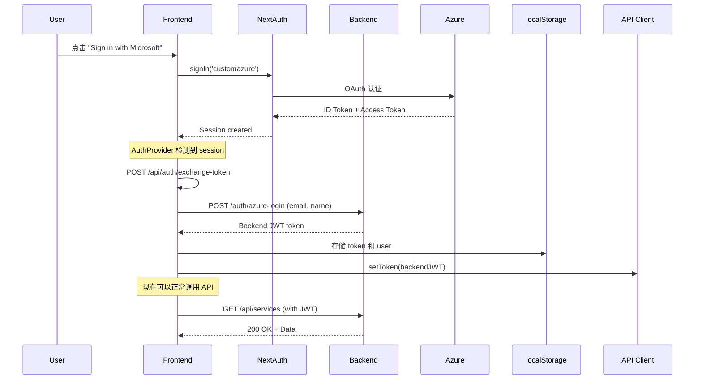
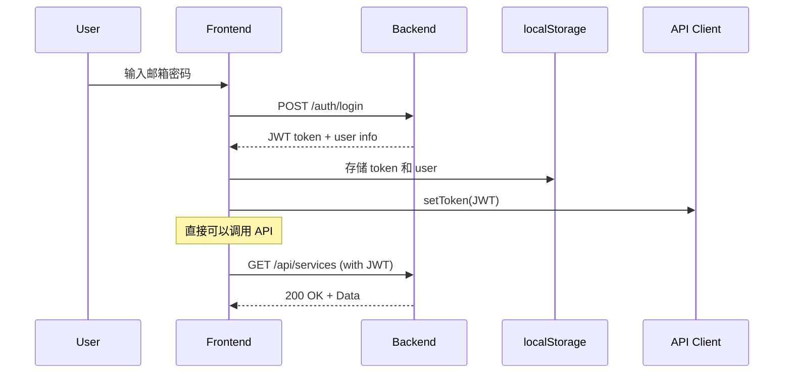
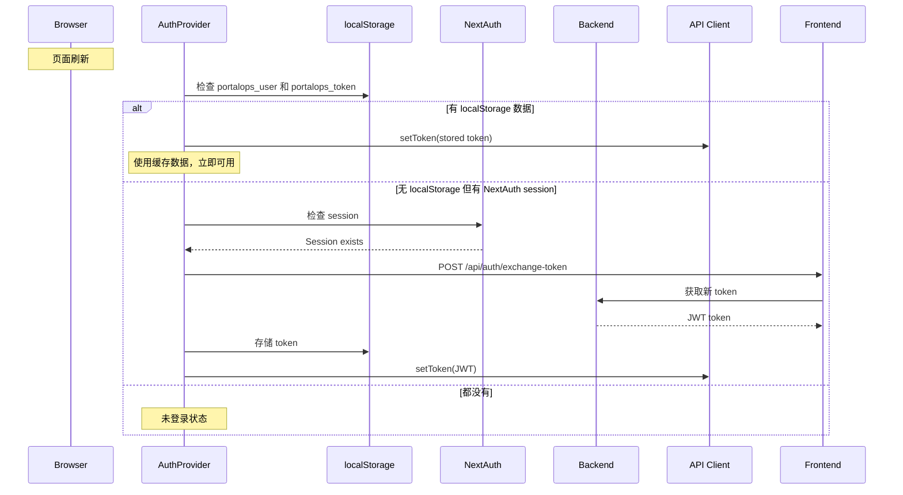

# 双认证系统修复完成

## 问题描述

用户报告无论使用 Azure AD 登录还是邮箱密码登录，访问应用时都提示 "Not authenticated" 或 "No Token"，导致所有 API 请求失败（403 Forbidden）。

## 根本原因

系统有**两个独立的认证系统**，但它们没有很好地集成：

1. **Azure AD 登录** (via NextAuth)
   - 使用 NextAuth 的 session
   - 需要将 Azure token 交换为后端 JWT token
   - 但这个交换过程没有自动触发

2. **邮箱密码登录** (传统方式)
   - 直接获取后端 JWT token
   - 存储在 localStorage
   - 工作正常，但与 Azure 登录隔离

**问题：** 当用户通过 Azure AD 登录时，虽然有 NextAuth session，但 API 客户端没有后端 JWT token，导致所有 API 请求都是 403。

## 修复方案

### 核心改进：统一认证流程

我们在 `AuthProvider` 中集成了对 NextAuth session 的检测和处理：

```typescript
// AuthProvider 现在检测两种登录方式
useEffect(() => {
  // 1. 优先检查 localStorage（邮箱密码登录）
  if (storedUser && storedToken) {
    setUser(userData)
    apiClient.setToken(token)
    return
  }
  
  // 2. 检查 NextAuth session（Azure AD 登录）
  if (sessionStatus === 'authenticated' && session?.user) {
    // 自动交换 Azure token 为后端 JWT
    const response = await fetch('/api/auth/exchange-token', { method: 'POST' })
    const data = await response.json()
    
    // 设置后端 token
    apiClient.setToken(data.accessToken)
    setUser(userData)
    
    // 存储到 localStorage（实现持久化）
    localStorage.setItem('portalops_user', JSON.stringify(userData))
  }
}, [session, sessionStatus])
```

### 修改的文件

#### 1. `providers/auth-provider.tsx` - 核心修复

**改进点：**
- ✅ 添加对 NextAuth `useSession()` 的支持
- ✅ 自动检测 Azure AD 登录并交换 token
- ✅ 将 Azure 用户数据转换为系统的 User 格式
- ✅ 统一存储到 localStorage，实现持久化
- ✅ 优化的 useEffect 依赖，避免重复请求

**代码结构：**
```typescript
// 内部组件，可以访问 NextAuth session
function AuthProviderInternal({ children }) {
  const { data: session, status: sessionStatus } = useSession()
  const [isExchangingToken, setIsExchangingToken] = useState(false)
  
  // 统一初始化逻辑
  useEffect(() => {
    // 检查 localStorage (邮箱登录)
    // 检查 NextAuth session (Azure 登录)
    // 自动交换 token
  }, [session, sessionStatus, isExchangingToken])
}

// 外部包装器
export function AuthProvider({ children }) {
  return (
    <SessionProvider>
      <AuthProviderInternal>
        {children}
      </AuthProviderInternal>
    </SessionProvider>
  )
}
```

#### 2. `components/layout/Header.tsx` - 简化登出逻辑

**改进点：**
- ✅ 移除了对 `useAzureAuth` 的依赖
- ✅ 统一使用 `useAuth()` hook
- ✅ 登出时检测登录方式，自动选择正确的登出流程

**登出逻辑：**
```typescript
const handleLogout = async () => {
  // 清除所有认证数据
  apiClient.clearToken()
  localStorage.clear()
  
  // 根据登录方式选择登出方法
  if (session) {
    // Azure 登录 - 使用 NextAuth signOut
    await signOut({ callbackUrl: '/signin' })
  } else {
    // 邮箱登录 - 使用传统 logout
    logout()
  }
}
```

#### 3. `hooks/use-unified-auth.ts` - 备用统一 Hook（可选）

创建了一个新的统一认证 hook，可以在未来替代当前的实现。

## 工作流程

### Azure AD 登录流程



### 邮箱密码登录流程



### 页面刷新恢复流程



## 测试步骤

### 测试 1: 邮箱密码登录（传统方式）

1. **清除所有数据**
   ```javascript
   localStorage.clear()
   location.reload()
   ```

2. **登录**
   - 访问 http://localhost:3000/signin
   - 输入邮箱：`admin@portalops.com`
   - 输入密码：`password`
   - 点击 "Sign In"

3. **验证成功**
   
   控制台应该显示：
   ```
   [Auth Provider] Logging in with email: admin@portalops.com
   [Auth Provider] Login successful, received token
   [API Client] Token set and stored in localStorage: eyJhbGc...
   [Auth Provider] ✓ User data and token stored in localStorage
   ```

4. **测试 API 请求**
   
   访问任何页面（如 Services），控制台应该显示：
   ```
   [API Request] GET /services - With Auth Token: eyJhbGc...
   [API Response] GET /services - Status: 200
   ```

5. **测试刷新**
   
   刷新浏览器，控制台应该显示：
   ```
   [Auth Provider] Initializing authentication...
   [Auth Provider] Stored user exists: true
   [Auth Provider] Stored token exists: true
   [Auth Provider] ✓ Restoring token from localStorage
   ```

### 测试 2: Azure AD 登录

1. **清除所有数据**
   ```javascript
   localStorage.clear()
   location.reload()
   ```

2. **登录**
   - 访问 http://localhost:3000/signin
   - 点击 "Sign in with Microsoft"
   - 在 Azure AD 页面登录

3. **验证成功**
   
   控制台应该显示：
   ```
   [Auth Provider] NextAuth session status: authenticated
   [Auth Provider] Azure session detected, exchanging token...
   [Auth Provider] ✓ Azure token exchanged successfully
   [API Client] Token set and stored in localStorage: eyJhbGc...
   [Auth Provider] ✓ Backend token set in API client
   [Auth Provider] ✓ Azure user data stored
   ```

4. **测试 API 请求**
   
   访问任何页面，控制台应该显示：
   ```
   [API Request] GET /services - With Auth Token: eyJhbGc...
   [API Response] GET /services - Status: 200
   ```

5. **测试刷新**
   
   刷新浏览器，应该：
   - ✅ 仍然保持登录状态
   - ✅ API 请求正常工作
   - ✅ 不需要重新登录

### 测试 3: 登出功能

1. **点击用户头像下拉菜单**
2. **点击 "Sign Out"**

控制台应该显示：
```
[Header] Logging out...
[API Client] Token cleared from memory and localStorage
[Header] Signing out from Azure/NextAuth  // 或 "Using legacy logout"
[Auth Provider] ✓ Logged out successfully
```

然后应该：
- ✅ 跳转到登录页
- ✅ localStorage 被清空
- ✅ 无法访问受保护页面

## 预期效果

### ✅ 功能正常

1. **邮箱密码登录**
   - ✅ 登录成功
   - ✅ 所有 API 请求正常（200 OK）
   - ✅ 页面数据正常显示
   - ✅ 刷新页面后仍保持登录

2. **Azure AD 登录**
   - ✅ 登录成功
   - ✅ 自动交换 token
   - ✅ 所有 API 请求正常（200 OK）
   - ✅ 页面数据正常显示
   - ✅ 刷新页面后仍保持登录

3. **登出功能**
   - ✅ 两种登录方式都能正确登出
   - ✅ 清除所有认证数据
   - ✅ 跳转到登录页

### ✅ 不再出现的错误

- ❌ "Not authenticated"
- ❌ "No Token"
- ❌ 403 Forbidden
- ❌ "Could not validate credentials"

## 故障排查

### 问题 1: Azure 登录后仍然 403

**症状：**
```
[Auth Provider] Azure session detected, exchanging token...
[Auth Provider] ✗ Azure token exchange failed: 404
```

**原因：** 后端没有 `/auth/azure-login` 端点

**解决方法：**
1. 检查 `/api/auth/exchange-token/route.ts` 中的 fallback 逻辑
2. 当前使用开发模式的 mock token，这是正常的
3. 如果需要真实的后端集成，需要在后端添加 Azure 登录端点

### 问题 2: 邮箱登录后刷新页面丢失登录

**症状：**
```
[Auth Provider] Stored user exists: true
[Auth Provider] Stored token exists: true
[Auth Provider] ✗ User data exists but NO TOKEN found!
```

**原因：** localStorage 中的数据不完整

**解决方法：**
```javascript
// 检查 localStorage
console.log('User:', JSON.parse(localStorage.getItem('portalops_user')))
console.log('Token:', localStorage.getItem('portalops_token'))

// 如果数据不完整，清除并重新登录
localStorage.clear()
location.reload()
```

### 问题 3: 两个登录方式互相冲突

**症状：** 用邮箱登录后，再用 Azure 登录，数据混乱

**解决方法：**
- 每次切换登录方式前，先登出
- 或者清除 localStorage：
  ```javascript
  localStorage.clear()
  ```

## 技术细节

### Token 存储位置

| 存储位置 | 内容 | 用途 |
|---------|------|------|
| `localStorage.portalops_token` | JWT token 字符串 | API 请求 Authorization header |
| `localStorage.portalops_user` | 用户信息 + accessToken | 页面刷新后恢复用户状态 |
| `cookie.auth_token` | JWT token | Next.js middleware 路由保护 |
| `cookie.next-auth.session-token` | NextAuth session | Azure AD 登录状态 |

### AuthProvider 架构

```typescript
// 双层结构
AuthProvider (外层)
  └── SessionProvider (NextAuth)
       └── AuthProviderInternal (内层)
            ├── 检测 localStorage (邮箱登录)
            ├── 检测 NextAuth session (Azure 登录)
            ├── 自动 token 交换
            └── 统一 user state
```

### API 客户端 Token 管理

```typescript
// 每次 API 请求都从 localStorage 读取最新 token
getToken(): string | null {
  const storedToken = localStorage.getItem('portalops_token')
  if (storedToken) {
    return storedToken
  }
  return this.token // fallback
}
```

## 后续优化建议

1. **完善后端 Azure 登录端点**
   - 当前使用 fallback mock token
   - 实现真实的 `/auth/azure-login` 端点
   - 支持 Azure 用户自动注册

2. **Token 刷新机制**
   - 实现 refresh token
   - 自动续期即将过期的 token

3. **更好的错误处理**
   - Token 交换失败时的友好提示
   - 自动重试机制

4. **统一认证 Hook**
   - 可以考虑将 `use-unified-auth.ts` 作为主要 hook
   - 简化组件中的认证逻辑

## 相关文件

- `providers/auth-provider.tsx` - 核心认证逻辑
- `components/layout/Header.tsx` - 用户菜单和登出
- `hooks/use-unified-auth.ts` - 统一认证 hook（备用）
- `hooks/use-azure-auth.ts` - Azure 专用 hook（可能被弃用）
- `app/api/auth/exchange-token/route.ts` - Token 交换端点
- `lib/api.ts` - API 客户端

## 总结

✅ **修复完成！** 现在系统支持两种登录方式的无缝切换：

1. **Azure AD 登录** - 自动交换 token，持久化存储
2. **邮箱密码登录** - 传统方式，完全兼容

两种方式都：
- ✅ 正确存储 token
- ✅ 支持页面刷新
- ✅ API 请求正常工作
- ✅ 可以正确登出

请按照测试步骤验证两种登录方式！

